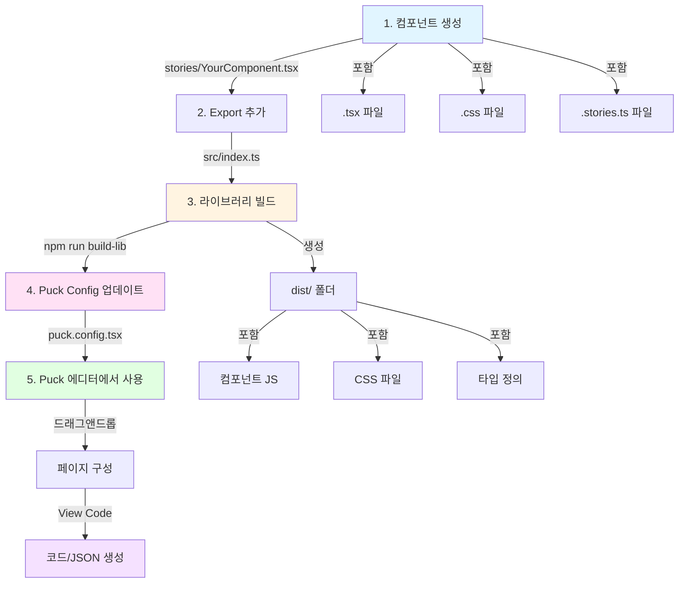
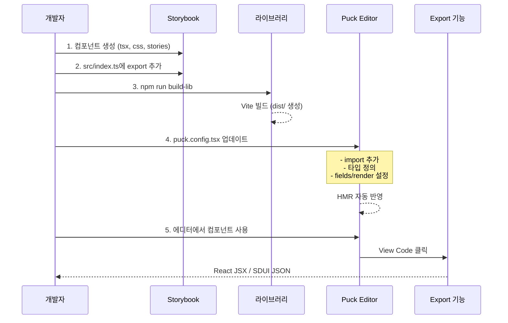
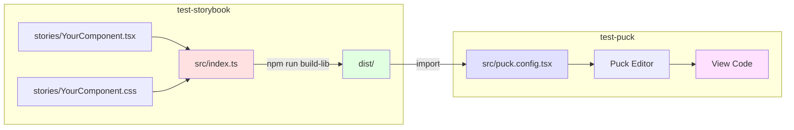

# Storybook → Puck 컴포넌트 추가 워크플로우

## 📊 워크플로우 다이어그램



### 전체 플로우



### 파일 구조 흐름



---

## 🔄 빠른 가이드

### 1. Storybook에서 컴포넌트 생성

**위치:** `test-storybook/stories/`

```bash
# 파일 생성
stories/
├── YourComponent.tsx      # 컴포넌트
├── YourComponent.css      # 스타일
└── YourComponent.stories.ts  # 스토리
```

**컴포넌트 예시:**
```tsx
// YourComponent.tsx
import React from 'react';
import './YourComponent.css';

export interface YourComponentProps {
  label?: string;
  value?: string;
}

export const YourComponent = ({ label, value }: YourComponentProps) => {
  return <div>{/* 구현 */}</div>;
};
```

---

### 2. 라이브러리 Export 추가

**파일:** `test-storybook/src/index.ts`

```ts
export { YourComponent } from '../stories/YourComponent';
export type { YourComponentProps } from '../stories/YourComponent';
```

---

### 3. 라이브러리 빌드

```bash
cd test-storybook
npm run build-lib
```

---

### 4. Puck Config 업데이트

**파일:** `test-puck/src/puck.config.tsx`

```tsx
// 1. Import 추가
import { YourComponent } from 'test-storybook-components';

// 2. 타입 정의
export type UserComponentProps = {
  YourComponent: {
    label?: string;
    value?: string;
  };
  // ... 기존 타입들
};

// 3. Config 추가
export const config: Config<UserComponentProps> = {
  components: {
    YourComponent: {
      fields: {
        label: { type: 'text', label: 'Label' },
        value: { type: 'text', label: 'Value' },
      },
      defaultProps: {
        label: 'Default Label',
        value: '',
      },
      render: ({ label, value }) => {
        return <YourComponent label={label} value={value} />;
      },
    },
    // ... 기존 컴포넌트들
  },
};
```

---

### 5. 확인

- **Storybook**: http://localhost:6006/
- **Puck Editor**: http://localhost:5174/

---

## 📝 실제 예시: mcncInput

### 1. 생성
```bash
stories/mcncInput.tsx       # 컴포넌트
stories/mcncInput.css       # 스타일
stories/mcncInput.stories.ts # 스토리
```

### 2. Export
```ts
// src/index.ts
export { McncInput } from '../stories/mcncInput';
```

### 3. 빌드
```bash
npm run build-lib
```

### 4. Puck 설정
```tsx
import { McncInput } from 'test-storybook-components';

// Config에 추가
McncInput: {
  fields: {
    label: { type: 'text' },
    placeholder: { type: 'text' },
  },
  defaultProps: {
    label: 'Input Field',
  },
  render: (props) => <McncInput {...props} />,
}
```

### 5. 결과
Puck 에디터 좌측 패널에 McncInput 표시 → 드래그앤드롭 사용 가능

---

## 🎯 핵심 포인트

| 단계 | 위치 | 명령어 |
|------|------|--------|
| 컴포넌트 생성 | `test-storybook/stories/` | - |
| Export 추가 | `test-storybook/src/index.ts` | - |
| 빌드 | `test-storybook/` | `npm run build-lib` |
| Puck 설정 | `test-puck/src/puck.config.tsx` | - |
| 확인 | 브라우저 | HMR 자동 반영 |

---

## 🔧 Puck Field 타입

```tsx
fields: {
  text: { type: 'text', label: 'Text' },
  number: { type: 'number', label: 'Number' },
  radio: {
    type: 'radio',
    options: [
      { label: 'Option 1', value: true },
      { label: 'Option 2', value: false }
    ]
  },
  select: {
    type: 'select',
    options: [
      { label: 'Small', value: 'sm' },
      { label: 'Large', value: 'lg' }
    ]
  },
}
```

---

## 💡 Tips

- **HMR 활용**: Puck 설정 변경 시 자동 반영
- **Storybook 확인**: 컴포넌트를 먼저 Storybook에서 테스트
- **타입 안전성**: Props 타입을 정확히 정의
- **CSS 포함**: 빌드 시 CSS 자동 포함됨

---

## 📦 프로젝트 구조

```
test-storybook/          # 컴포넌트 라이브러리
├── stories/             # Storybook 컴포넌트
├── src/index.ts         # Export 엔트리
└── dist/                # 빌드 결과

test-puck/               # Puck 페이지 빌더
├── src/
│   ├── puck.config.tsx  # Puck 설정
│   └── App.tsx          # 메인 앱
└── node_modules/
    └── test-storybook-components/  # 링크된 라이브러리
```
